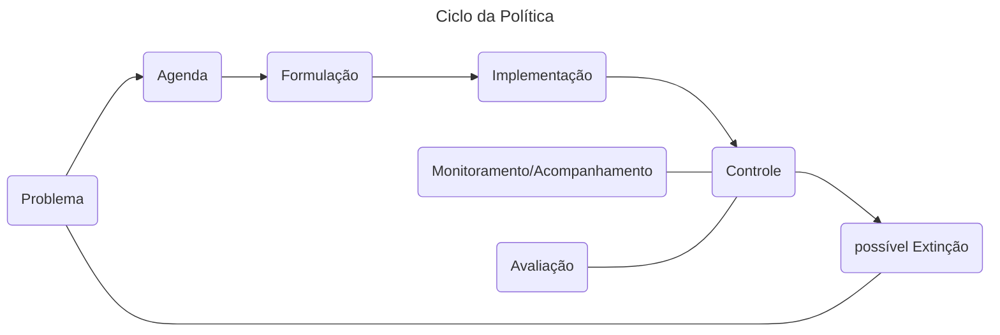
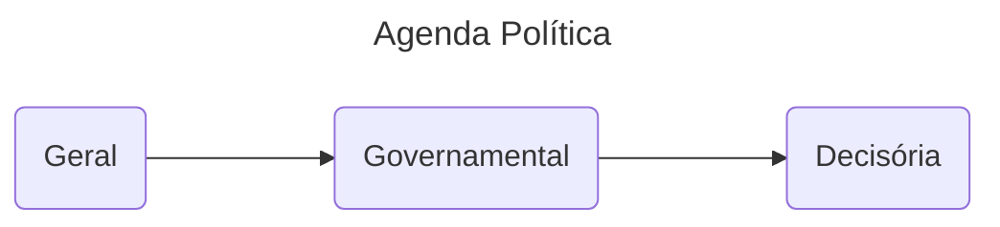
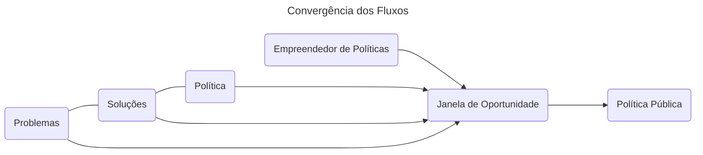

## Políticas Públicas (AG)

### 1. Políticas Públicas: Definições e Componentes[^1][^2]

[^1]: [Aula de referência](https://www.grancursosonline.com.br/aluno/espaco/curso/codigo/LnSvy5x%2FUpk%3D/v/9UYDkmbpPEM%3D/c/MtHf5PJ32GI%3D)

[^2]: [Caderno de questões](https://questoes.grancursosonline.com.br/questoes?assunto=426503%2C426502&desatualizada=0&anulada=0&query=)

#### Sociedade Moderna

- A sociedade moderna ==lida com conflito== por dois métodos: <mark>coerção e/ou política.</mark>

- Enquanto uma vai para além da via democrática, a outra se propõe à resolver conflitos de maneira pacífica.

#### Polity, politics e policy

- <mark>*Polity*</mark> é a <mark>dimensão institucional</mark>, que se refere às instituições que moldam o funcionamento do sistema político.
- <mark>*Politics*</mark> é a <mark>dimensão processual</mark>, que se refere ao processo político, frequentemente de caráter conflituoso, onde há tomada de decisões.
- <mark>*Policy*</mark> é a <mark>dimensão material</mark>, que se refere aos programas políticos e políticas públicas.

> As políticas públicas (_policies_) são produtos, resultantes da atividade política (_politics_). 
>
> *— Graças Ruas*

- O <mark>sistema político</mark> aberto recebe *inputs* da sociedade, somados com os *withinputs* (demandas geradas no interior do sistema político) que <mark>produzem</mark> *outputs*. Esses *outputs* podem ser <mark>(1) <u>decisões políticas</u> ou (2) <u>políticas públicas</u>.</mark>
- Toda política pública envolve decisões políticas. Nem toda decisão política envolve política pública.

> (Política pública) trata-se de um fluxo de decisões políticas, orientado a manter o equilíbrio social ou a introduzir desequilíbrios destinados a modificar essa realidade.
>
> *— Enrique Saraiva*

#### Componentes das Políticas Públicas

Segundo Saraiva, há <mark>4 componentes</mark> comuns para as políticas públicas:

- <mark>Institucional</mark>: legalmente constituída por autoridade formal e coletivamente vinculante.
- ==Decisório==: conjunto de decisões de fins e meios como resposta aos problemas e necessidades.
- ==Comportamental==: uma política sempre significa a escolha de um curso de ação, seja fazer ou não fazer.
- ==Causal==: são produtos de ações que tem efeitos no sistema político e social.

### 2. Ciclo de Políticas Públicas[^3][^4]

[^3]:[Aula de referência](https://www.grancursosonline.com.br/aluno/espaco/curso/codigo/LnSvy5x%2FUpk%3D/v/pBZmt7ebEu8%3D/c/MtHf5PJ32GI%3D)
[^4]: [Caderno de questões](https://questoes.grancursosonline.com.br/aluno/filtro/concursos?assunto=426508%2C426524&desatualizada=0&anulada=0&query=)

#### Inputs

- ==Apoios==: Obediência e cumprimento de leis e regulamentos; pagamentos de tributos e participação de serviços; atos de participação política; respeito à autoridade e símbolos nacionais; pagamento de tributos.

- ==Demandas==: reivindicações de bens e serviços; exigência de participação política; demandas pela atuação regulamentar do setor público.  Elas ==são divididas em (1) novas, (2) recorrentes e (3) reprimidas.== Da demanda reprimida, é mantido um **estado de coisas**.

 #### Ciclo da Política (*policy cicle*)

O ciclo dividido em etapas é meramente teórico. ==No mundo real, essas etapas se sobrepõem== e podem acontecer concomitantemente, como por exemplo: aqueles que implementam a político tomam certas decisões para que isso aconteça.

#### Arenas (*policy arena*)

Se refere aos processos de conflito e de consenso dentro das diversas áreas políticas. Há depender da política pública discutida, pode haver uma correlação de forças que gere mais conflitos ou mais consensos. 

Os tipos de políticas públicas seguem ==4 classificações==, segundo a ==**tipologia de Lowi**: as de caráter distributivo, redistributivo, regulatório e constitutivo (ou estruturador).==

==**Políticas distributivas**: baixo grau de conflito==, pois parecem distribuir vantagens e não acarretam custos (e quando acarretam, são invisíveis ou ínfimos) para outros grupos. *Exemplo: distribuição de cestas básicas para vítimas de uma enchente.*

==**Políticas redistributivas**: alto grau de conflito==, pois busca o deslocamento de recursos entre camadas sociais ou entre diferentes grupos sociais. Ganho alto para uns, custo alto para outros. *Exemplo: taxação de grandes fortunas.*

==**Políticas regulatórias**: o grau de conflito muda de acordo com as configurações específicas da política==, já que ela utiliza instrumentos normativos diversos para regular algo.

==**Políticas constitutivas** (ou estruturadoras): são políticas que determinam as regras do jogo==, estruturando o próprio sistema político.

### 3. Múltiplos Fluxos de Kingdon[^5][^6]

[^5]: [Aula de referência](https://www.grancursosonline.com.br/aluno/espaco/curso/codigo/LnSvy5x%2FUpk%3D/v/eIR99jLycfc%3D/c/MtHf5PJ32GI%3D)
[^6]: [Caderno de questões](https://questoes.grancursosonline.com.br/questoes?assunto=426523&desatualizada=0&anulada=0&query=multiplo+fluxo)

==A agenda política tem **<u>três</u>** níveis diferentes==, que se afunilam um após o outro. Esses níveis são:

Alguns problemas de natureza pública vão percorrer esse caminho, mas nem todos. Qual a explicação para isso? ==Segundo Kingdom, **<u>três grandes fluxos</u>** relativamente independentes <u>**precisam**</u> convergir para que haja o avanço na agenda política.== Esses fluxos são:

- O reconhecimento do problema;
- A formulação de soluções (*policy*);
- A política (*politics*).

Destrinchando cada um desses momentos:

- ==**Reconhecimento de um problema**==: a partir de ==crise== ou ==evento dramático==; a partir de ==indicadores==, pois tanto a magnitude de um dado ou sua mudança chama atenção de autoridades; a partir da ==acumulação de informações e experiências==.
- ==**Formação de soluções**==: depende dos especialistas da ==comunidade técnico-científica== e serão selecionadas a partir da ==viabilidade técnica, financeira e política== da solução.

- **==Política favorável==**: que pode surgir a partir da ==mudança de governo==, da ==organização de forças e agentes sociais== ou da mudança do ==*national mood*==.

Depois de convergidos os três fluxos, ainda é necessário que haja ==empreendedores políticos== (*policy entrepreneurs*), aqueles que agirão para que a política pública possa se concretizar.

### 4. Processo Decisório[^7][^8]

[^7]:[Aula de referência](https://www.grancursosonline.com.br/aluno/curso/video/codigo/LnSvy5x%2FUpk%3D/v/LnPD6DRY7W0%3D/c/MtHf5PJ32GI%3D?aba=painel)
[^8]:[Caderno de questões](https://questoes.grancursosonline.com.br/aluno/filtro/concursos?assunto=426523%2C426527&desatualizada=0&anulada=0&query=)

